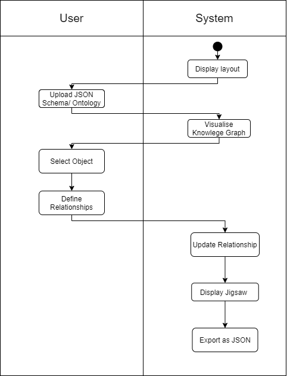

<!--
*** Thanks for checking out the Best-README-Template. If you have a suggestion
*** that would make this better, please fork the repo and create a pull request
*** or simply open an issue with the tag "enhancement".
*** Thanks again! Now go create something AMAZING! :D
-->


<!-- PROJECT SHIELDS -->
<!--
*** I'm using markdown "reference style" links for readability.
*** Reference links are enclosed in brackets [ ] instead of parentheses ( ).
*** See the bottom of this document for the declaration of the reference variables
*** for contributors-url, forks-url, etc. This is an optional, concise syntax you may use.
*** https://www.markdownguide.org/basic-syntax/#reference-style-links
-->
[![Contributors][contributors-shield]][contributors-url]


<!-- PROJECT LOGO -->
<br />
<p align="center">
  <a href="https://github.com/SWENG-Group-10/Intuitive-Design-for-Knowledge-Graph-Mappings">
    
  </a>

  <h3 align="center">Intuitive Design for Knowledge Graph Mappings</h3>

  <p align="center">
    <a href="https://sweng-group-10.github.io/Intuitive-Design-for-Knowledge-Graph-Mappings">View Demo</a>
    
  </p>
</p>


<!-- TABLE OF CONTENTS -->
<details open="open">
  <summary>Table of Contents</summary>
  <ol>
    <li>
      <a href="#about-the-project">About The Project</a>
      <ul>
        <li><a href="#built-with">Built With</a></li>
      </ul>
    </li>
    <li>
      <a href="#getting-started">Getting Started</a>
    </li>
    <li><a href="#acknowledgements">Acknowledgements</a></li>
  </ol>
</details>


<!-- ABOUT THE PROJECT -->
## About The Project

[![Product Name Screen Shot][product-screenshot]](https://example.com)

The purpose of the system is to allow users to easily create, edit and visualise Knowledge Graphs from imported files. The editor will be built to allow for a more user-friendly and visually appealing interface than is currently available. 


Here's why:
* There exist certain systems that provide some aspects of functionality of the project. These systems however lack a GUI that is easy to learn and visually appealing.
* Current Systems are unintuitive for non-tech literate people to use and require a strong background of understanding the systems and files in which they are trying to use to create KG’s.

### Built With

* [Vue 2.0](https://vuejs.org/)
* [Vuetify](https://vuetifyjs.com/en/)
* [WebVowl](http://visualdataweb.de/webvowl//#opts=doc=0;editorMode=true;\#iri=https://raw.githubusercontent.com/SemanGit/SemanGit/master/Documentation/ontology/semangitontology.ttl)


<!-- GETTING STARTED -->
## Getting Started


To get a local copy up and running follow these simple example steps.

## Project setup
```
npm install
```

### Compiles and hot-reloads for development
```
npm run serve
```

### Compiles and minifies for production
```
npm run build
```

### Lints and fixes files
```
npm run lint
```

### Customize configuration
See [Configuration Reference](https://cli.vuejs.org/config/).


<!-- USAGE EXAMPLES -->
## Usage
<p align="center">
</p>
This particular sequence is a sequence where the user uploads a Schema or Ontology. The system then displays the KG. The user then selects an object from the ontology and defines any relationship that object has to another or defines an attribute of the selected object. The system updates the attributes and relationships of the object, the system can export the updated schema as JSON.


<!-- CONTRIBUTING -->


<!-- LICENSE -->


<!-- CONTACT -->


<!-- ACKNOWLEDGEMENTS -->
## Acknowledgements
* [Best README Template](https://github.com/othneildrew/Best-README-Template)


<!-- MARKDOWN LINKS & IMAGES -->
<!-- https://www.markdownguide.org/basic-syntax/#reference-style-links -->
[contributors-shield]: https://img.shields.io/github/contributors/othneildrew/Best-README-Template.svg?style=for-the-badge
[contributors-url]: https://github.com/SWENG-Group-10/Intuitive-Design-for-Knowledge-Graph-Mappings/contributors
[product-screenshot]: images/screenshot.png
